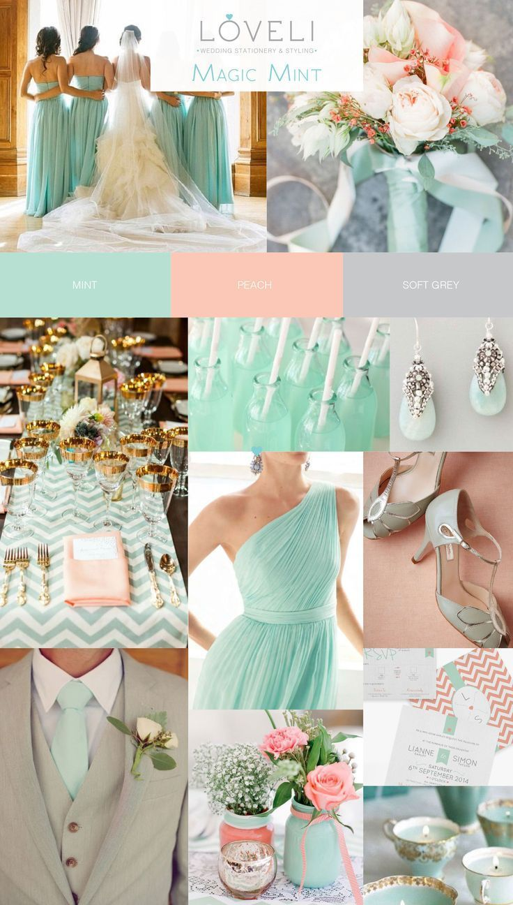

# **Ciara and Sam's Big Day**

## **Project Outline** 

This site will provide the bride and groom with the ability to give their wedding guests all the information they need for the day and a way to accept or decline the invitation, decide which menu choices each member in the guests party want and chose a wedding gift or gift some money. The bride and groom will have control over the guest details, the menu choices, the days' schedule and the gift list. The site will also give the bride and groom the ability to check the status of the invitations and the menu choices the guests have made which will allow the bride and groom to chase only those who have not replied or have provided details of food requirements. Finally the bride and groom should be able to arrange the table seating based on the guests who have accepted.

``` Mock up Image ```

You can find the original website here []().

---

<a></a>

## Table of contents 
* [UX](#ux)
    * [User Goals](#user-goals)
    * [User Stories](#user-stories)
    * [User Requirements and Expectations](#user-requirements-and-expectations)
        * [Requirements](#requirements)
        * [Expectations](#expectations)
    * [Design Choices](#design-choices)
        * [Fonts](#fonts)
        * [Colors](#colors)
        * [Structure](#structure)
* [Wireframes and Flowcharts](#wireframes-and-flowcharts)
    * [Wireframes](#wireframes)
    * [Flowcharts](#flowcharts)
    * [Database Structure](#database-structure)
* [Features](#features)
    * [Existing Features](#existing-features)
    * [Features to be implemented](#features-to-be-implemented)
* [Technologies used](#technologies-used)
    * [Languages](#languages)
    * [Libraries and Frameworks](#libraries-and-frameworks)
    * [Tools](#tools)
* [Testing](#testing)
* [Deployment](#deployment)
    * [Local Deployment](#local-deployment)
    * [Heroku Deployment](#heroku-deployment)
* [Credits](#credits)

--- 

<a name="ux"></a>

## **UX**

<a></a>

### **User Goals**

* The landing page should have a romantic wedding feel for the couple and provide some details about the occaision to the guests who will be invited to create an account.
* The website must 
  * be responsive on all types of devices including mobile phones, tables and desktops.
  * have the ability to maintain the guest list, menu, gift list and schedule for the day including venue details.
  * have the ability to make financial transactions, i.e. allow the guests to give money as a wedding gift. 
  * have details about the local area including alternative accommodation an public transport information.
  * include any Covid19 requirements which can be switched of if no longer needed.
* The website must be visually appealing to the bride and groom.

[Back to Top](#table-of-contents)

<a></a>

### **User Stories**

#### Bride or Groom:  
<<<<<<< HEAD
* [#1](https://github.com/SiobhanBaines/Ciara-and-Sams-Big-Day/issues/1)  - As a user I want to register an account with administration access.
* [#2](https://github.com/SiobhanBaines/Ciara-and-Sams-Big-Day/issues/2)  - As a user I want to be able to log into the website.
* [#3](https://github.com/SiobhanBaines/Ciara-and-Sams-Big-Day/issues/3)  - As a user I want to be able to create a list of all the wedding guests.
* [#4](https://github.com/SiobhanBaines/Ciara-and-Sams-Big-Day/issues/4)  - As a user I want to maintain the menu options for the day.
* [#5](https://github.com/SiobhanBaines/Ciara-and-Sams-Big-Day/issues/5)  - As a user I want to mainttain a wedding gift list.
* [#6](https://github.com/SiobhanBaines/Ciara-and-Sams-Big-Day/issues/6)  - As a user I want to use the list of guests who have accept to create the seating plan for the wedding breakfast.
* [#7](https://github.com/SiobhanBaines/Ciara-and-Sams-Big-Day/issues/7)  - As a user I want to keep track of which guests have and have not RSVP'ed.
* [#8](https://github.com/SiobhanBaines/Ciara-and-Sams-Big-Day/issues/8)  - As a user I want to keep track of which guests have or have not supplied their menu choices.
* [#9](https://github.com/SiobhanBaines/Ciara-and-Sams-Big-Day/issues/9)  - As a user I want to create a schedule for the day.
* [#10](https://github.com/SiobhanBaines/Ciara-and-Sams-Big-Day/issues/10) - As a user I want to provide the guests with details of the church.
* [#11](https://github.com/SiobhanBaines/Ciara-and-Sams-Big-Day/issues/11) - As a user I want to provide the guests with details of the reception.
* [#12](https://github.com/SiobhanBaines/Ciara-and-Sams-Big-Day/issues/12) - As a user I want to provide the guests with details of accommodation close to the reception.
* [#13](https://github.com/SiobhanBaines/Ciara-and-Sams-Big-Day/issues/13) - As a user I want to provide the guests with details of local public transport.
* [#14](https://github.com/SiobhanBaines/Ciara-and-Sams-Big-Day/issues/14) - As a user I want to know who as given a donation so I can thank them after the event.
* [#15](https://github.com/SiobhanBaines/Ciara-and-Sams-Big-Day/issues/15) - As a user I want to have the ability to stop any Covid19 restrictions being displayed if the restrictions are lifted.

#### Wedding Guest
* [#16](https://github.com/SiobhanBaines/Ciara-and-Sams-Big-Day/issues/16) - As a user I want to register an account.
* [#17](https://github.com/SiobhanBaines/Ciara-and-Sams-Big-Day/issues/17) - As a user I want to be able to log into the website.
* [#18](https://github.com/SiobhanBaines/Ciara-and-Sams-Big-Day/issues/18) - As a user I want to provide my name and contact details.
* [#19](https://github.com/SiobhanBaines/Ciara-and-Sams-Big-Day/issues/19) - As a user I want to accept the wedding invitation.
* [#20](https://github.com/SiobhanBaines/Ciara-and-Sams-Big-Day/issues/20) - As a user I want to decline the wedding invitation.
* [#21](https://github.com/SiobhanBaines/Ciara-and-Sams-Big-Day/issues/21) - As a user I want to provide details of all members of my party.
* [#22](https://github.com/SiobhanBaines/Ciara-and-Sams-Big-Day/issues/22) - As a user I want to menu selections for all members of my party.
* [#23](https://github.com/SiobhanBaines/Ciara-and-Sams-Big-Day/issues/23) - As a user I want to provide details of any specific dietry requirements.
* [#24](https://github.com/SiobhanBaines/Ciara-and-Sams-Big-Day/issues/24) - As a user I want to choose a present from a list of gift ideas.
* [#25](https://github.com/SiobhanBaines/Ciara-and-Sams-Big-Day/issues/25) - As a user I want to give a donation as a wedding present.
* [#26](https://github.com/SiobhanBaines/Ciara-and-Sams-Big-Day/issues/26) - As a user I want confirmation of my invitation acceptance or decline.
* [#27](https://github.com/SiobhanBaines/Ciara-and-Sams-Big-Day/issues/27) - As a user I want confirmation of my menu choices.
* [#28](https://github.com/SiobhanBaines/Ciara-and-Sams-Big-Day/issues/28) - As a user I want confirmation of my donation. 

<a></a>


[Back to Top](#table-of-contents)

<a></a>

### **User Requirements and Expectations**

<a></a>

#### Requirements

* Easy to navigate by having a responsive navigation bar and various links to other pages througout the site.
* Romantic design in keeping with the bride and grooms chosen colour scheme.
* Bride and Groom
   * Easy maintenance of the guest list, the wedding breakfast menu, the schedule, covid19 restrictions and the gift list.
* Guests 
   * need to be able to easily RSVP the invitation.
   * be able to give a wedding gift
   * update their contact details
   * If the guests accept the invitation they will need to 
      * be able to choose from the menu options for each member of their party. 
* Provide location information of the ceremony and receiption
* Provide other local information

<a></a>

#### Expectations

* When clicking on links to external pages, I expect them to open in a different window.
* When the guests click the GUEST button I expect them to be taken to the RSVP page.
* I expect an email to be sent to the bride and groom and specfic flags to be updated when
   * the guest have RSVP'ed
   * the guest have selected from the menu options
   * if the guest sends a monetory donation including the amount of that donation
   * if a guest selects to buy a gift
* I expect the bride and groom to be able to search on the guest list by the various flags to check the status


[Back to Top](#table-of-contents)

<a></a>

### **Design Choices**

In designing this site I want to incorporate the bride and grooms colour scheme (mint green and peach) with the rustic but romantic feel of the venue with it's open beams and stunning views across the golf course. To make it special to Ciara and Sam a photograph of them will appear on the landing page.

##### Church 
[St Margaret Clitherow](http://stmargaretclitherowyork.org.uk/)
<a></a>

##### Receiption
[Sandburn Hall](https://www.sandburnhall.co.uk/)

#### Colors

The colours of the site are taken from the colour scheme the bride and groom have decided on which is mint green and peach. I have chosen to make the main colour off-white to keep the site bright and airy without being stark that would come with bright white as the main colour.
I initially used this  and [icolorpalette](https://icolorpalette.com/) to create a colour palette but the colours were muted in the palette so went back to the image and selected each of the block colours to find the closest match.

The main background colour will be #FCFCF4 which is almost white and will create a bright and airy feel to the site

* Primary Peach #FBC8B7 RGB(251,200,183)
* Secondary Peach #FFF9F7 RGB(255,249,247)
* Primary Mint #B7E0D2 RGB(183,224,210)
* Secondary Mint #E9F7F2 RGB(233,247,242)
* Primary Grey #C7C8CA  RGB(199, 200, 202)
* Primary Font #6e6f70 RGB(	110, 111, 112)
--primary-font: #48494a;
* Secondary Font Colour #947a27 RGB(148, 122, 39)

<a></a>


#### Fonts
In order to find appropriate fonts for my website, I have visited [Google Fonts](https://fonts.google.com/ "Google Fonts") to explore the various options.

For the initials of the bride and groom I will use the cursive font [Lovers Quarrel](https://fonts.google.com/specimen/Lovers+Quarrel?category=Handwriting&preview.text=C%20%26%20S&preview.text_type=custom#standard-styles), for the titles and subtitles I will use the font [Italianno](https://fonts.google.com/specimen/Italianno?preview.text=GUEST%20Login&preview.text_type=custom&slant=8#standard-styles) tbd
and for the main text I will use [Nunito](https://fonts.google.com/specimen/Nunito?preview.text=GUEST%20Login&preview.text_type=custom&stylecount=11)
`<link rel="preconnect" href="https://fonts.gstatic.com">
<link href="https://fonts.googleapis.com/css2?family=Italianno&family=Lovers+Quarrel&family=Nunito:wght@200&display=swap" rel="stylesheet">`
`font-family: 'Italianno', cursive;
font-family: 'Lovers Quarrel', cursive;
font-family: 'Nunito', sans-serif;`
<a></a>

#### Structure
##### Landing / Home Page

The landing page is designed to welcome the visitors and encouraging them to engage with the site. There will be an image of the bride and groom and some images and highlevel details of the ceremony and reception venues. There will be a `Guests` button which will take the guests to the RSVP page.
**Our Story Section**
A small introduction to the bride and groom with a full width carousel of images of the happy couple.
**Location Section**
Will show some of the history of York and a map of the area.
**Covid19 Section**
The current Covid19 restrictions will be shown here assuming they will still be needed by the date of the wedding.
##### Guest Login
The guests will be asked to login using a unique identifier, which will be on the wedding invitation and to confirm the postcode where the invitation was sent. From here they will automatically be taken to the RSVP page
##### RSVP Page
The first time the guest logs in, they will be asked to accept or decline the invitation and there will be the opportunity to leave a message. Subsequently the guest will have a navigation menu where they will have access to the menu, the gifts, the full venue details, the schedule of the day and useful local information. If a guest has declined the invitation they will still have access to buy a gift if they desire.
##### Guests Menu Page
The guests version of the menu page will have the menu options list and the names of all the guest in that party. There will also be a box under each name to give details of any allergies or special dietry requirements. Sandburn Hall have said they will do their best to accommodate all dietry requirements.  
##### Venue
Contains some information about the church where the ceremony will be held and about the receiption venue. There will be an image of each venue and the GoogleMaps location.
##### Gifts Page
This page will have details of any specific gifts the bride and groom would like where the guest wants to buy a present instead of giving the bride and groom money. There will be a donation box for the guest to gift the bride and groom money using **Stripe payments**
##### Wedding Schedule Page
Full details of the expected schedule of the day will be details here. * time the ceremony starts
* time of arrival at the reception venue
* time of the wedding breakfast
* time of the room turn around
* time of the evening celebration commences 
##### Guest List Pages
The guest list page will consist of 3 pages.
* the main page will allow the bride and groom to view
    * the guests names
    * the number of confirmed guests in that party
    * whether they have accepted or declined the invitation
    * if they selected their menu choices
* Page 2 will give the bride and groom the ability to add, change and delete guests
* Page 3 will allow the bride and groom to see the menu choices and what gifts have been selected
##### Menu Maintenance Page
The bride and groom will be able to add details about the starters, main course and deserts they have chosen for the wedding breakfast.
##### Gift Maintenance Page
The bridge and groom will have the ability to add gifts and remove them.

[Back to Top](#table-of-contents)

--- 
<a></a>

## **Wireframes, Flowcharts and Database Structure**

### **Wireframes**
I used [Balsamic](https://balsamiq.com/wireframes/) to create wireframes for my website.   
For each page I created 3 wireframes: desktop, tablet and mobile.
* **[Bride and Groom](wireframes/bride-groom-wireframes)**
* **[Guest](wireframes/guest-wireframes)**
* **[Global](wireframes/global-wireframes)**
### **Flowcharts**
Some of the flow of the site was a little complex so I created a flowchart to help clarify
[Flowchart](flowchart.docx)

### **Database Structure**
[Database Structure](database_structure.xlsx)

[Back to Top](#table-of-contents)

---

<a></a>

## **Features**

<a></a>

### **Existing Features**

* There is sign-in functionality using allauth from Django. I have note created a registration function because I will create super_user accounts for the bride and groom and the Guest login will use a unique code generated by Django, which will be printed on their invitation, as their username and the postcode where the guests invitation was sent, which may be different to the guest's current residence.
* There will be a carousel of photographs of the bride and groom in the Our Story section of the home page.
* Covid19 restrictions - there will be the ability to hide or show Covid19 restrictions.
* The RSVP on the card on the first screen will act as a link to the Guest login page.
* Once the guest has logged in, they will be taken to the RSVP page if they have not already RSVP'ed the invitation. If the guest has RSVP'ed, the login page will take them to a guest home page where the menu will differ dependant on whether the guest has accepted or declined the invitation.
* The guest menu page will allow the guest to select which dishes each guest in that party would like on the day. 
* The gifts page will allow the guests to either donate some money as a gift to the bride and groom or choose a gift to buy separately.
* There will be a schedule page with details of the proposed timings of events on the day.
* The venue page will have information about the venues for the ceremony and the receiption with a link to details about other accommodation and transport links.
* The super-users (bride and groom) will be able to add and change details about the menu, schedule, gifts and whether or not to display covid19 restrictions.


<a></a>

### **Features to be implemented**
* The ability for the bride and groom to add, change or delete covid19 restrictions
* The ability for the bridge and groom to add, change or delete the alternative accommodation and local transport information.

[Back to Top](#table-of-contents)

<a></a>

## **Technologies used**

<a></a>

### **Languages**

* [HTML](https://en.wikipedia.org/wiki/HTML)
* [CSS](https://en.wikipedia.org/wiki/Cascading_Style_Sheets)
* [JavaScript](https://en.wikipedia.org/wiki/JavaScript)
* [Python](https://www.python.org/)

<a></a>

### **Libraries and Frameworks**

* [Font Awesome](https://fontawesome.com/)
* [Bootstrap](https://getbootstrap.com/)
* [Google Fonts](https://fonts.google.com/)
* [jQuery](https://jquery.com/)
* [Stripe](http://stripe.com/)

### **Tools**
* [Django](https://www.djangoproject.com/)
* [Github](https://github.com/)
* [GitPod](https://www.gitpod.io/)
* [Heroku](https://www.heroku.com/)
* [Balsamic](https://balsamiq.com/wireframes/)
* [W3C HTML Validation Service](https://validator.w3.org/)
* [W3C CSS Validation Service](https://jigsaw.w3.org/css-validator/)
* [techsini](http://techsini.com/)
* [jshint](https://jshint.com/)


[Back to Top](#table-of-contents)

<a></a>

## Development Issues


## Testing
Testing of this site can be found [here](testing.md) in a seperate file

## Bugs
Bugs of this site can be found [here](bugs.md) in a seperate file


## **Deployment**


### Local Deployment


    
### To deploy your project on Heroku, use the following steps: 

[Back to Top](#table-of-contents)

<a></a>

## **Credits**

### Images
The below image was found on [shutterstock](https://www.shutterstock.com/image-photo/fresh-bouquet-roses-greeting-card-410660725) The artist [Aquatti](https://www.shutterstock.com/g/aquatti) has named it "Fresh bouquet of roses and greeting card". 


https://pythoncircle.com/post/30/how-to-upload-and-process-the-csv-file-in-django/
### Assistance
Scott @ CI Tutor support for helping me to load the users into django. I had made the whole process much more complex than necessary.

Simen - my mentor at CI for his ideas, inspiration and patience. 

