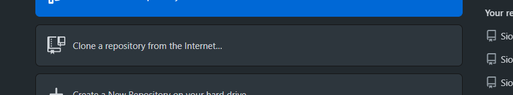
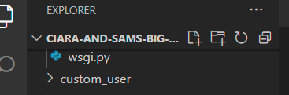

# **Ciara and Sam's Big Day**

## **Project Outline** 

This site will provide the bride and groom with the ability to give their wedding guests all the information they need for the day and a way to accept or decline the invitation, decide which menu choices each member in the guest's party want and chose a wedding gift or gift some money. The bride and groom will have control over the guest details, the menu choices, the days' schedule and the gift list. The site will also give the bride and groom the ability to check the status of the invitations and the menu choices the guests have made which will allow the bride and groom to chase only those who have not replied or have provided details of food requirements. Finally, the bride and groom should be able to arrange the table seating based on the guests who have accepted.

` Mock up Image `

You can find the original website here [ciara_and_sams_wedding](https://ciara-and-sams-wedding.herokuapp.com/).

---

## Table of contents 
* [UX](#ux)
    * [User Goals](#user-goals)
    * [User Stories](#user-stories)
		* [Bride or Groom](#bride-or-groom)
		* [Wedding Guest](#wedding-guest)
    * [User Requirements and Expectations](#user-requirements-and-expectations)
        * [Requirements](#requirements)
        * [Expectations](#expectations)
    * [Design Choices](#design-choices)
        * [Colours](#colours)
        * [Fonts](#fonts)
        * [Structure](#structure)
			* [Landing/Home Page](#landing/home-page)
			* [Registration](#registration)
			* [Login](#login)
			* [RSVP Page](#rsvp-page)
			* [Guests Menu Page](#guests-menu-page)
			* [Venue](#venue)
			* [Gifts Page](#gifts-page)
			* [Wedding Schedule Page](#wedding-schedule-page)
			* [Guest List Page](#guest-list-page)
			* [Menu Maintenance Page](#menu-maintenance-page)
			* [Gift Maintenance Page](#gift-maintenance-page)
* [Wireframes Flowcharts and Database Structure](#wireframes-flowcharts-and-database-structure)
    * [Wireframes](#wireframes)
    * [Flowcharts](#flowcharts)
    * [Database Structure](#database-structure)
* [Features](#features)
    * [Existing Features](#existing-features)
    * [Features to be implemented](#features-to-be-implemented)
* [Technologies used](#technologies-used)
    * [Languages](#languages)
    * [Libraries and Frameworks](#libraries-and-frameworks)
    * [Tools](#tools)
* [Development Issues](#development-issues)
	* [Testing](#testing)
	* [Bugs](#bugs)
* [Run Application in Gitpod](#run-application-in-gitpod)
* [Deployment](#deployment)
    * [Local Development](#local-development)
    * [Heroku Deployment](#heroku-deployment)
    	* [Initial Production Deployment](#initial-production-deployment)
	    * [Heroku](#heroku)
	    * [AWS](#aws)
    	* [Subsequent Production Deployment](#subsequent-production-deployment)
* [Credits](#credits)
	* [Toast](#toasts)
	* [Stripe](#stripe)
	* [Images](#images)
    * [Emails](#emails)
	* [Setting up bride/groom as 'staff's](#setting-up-bride/groom-as-'staff')
    * [Checking if user 'has_group'](#checking-if-user-'has_group')
    * [Assistance](#assistance)

--- 

## **UX**

### User Goals

* The landing page should have a romantic wedding feel for the couple and provide some details about the occaision to the guests who will be invited to create an account.
* The website must: 
  * be responsive on all types of devices including mobile phones, tables and desktops.
  * have the ability to maintain the guest list, menu, gift list and schedule for the day including venue details.
  * have the ability to make financial transactions, i.e., allow the guests to give money as a wedding gift. 
  * have details about the local area including alternative accommodation a public transport information.
  * include any Covid19 requirements which can be switched of if no longer needed.
* The website must be visually appealing to the bride and groom.

[Back to Top](#table-of-contents)

### User Stories

#### Bride or Groom
* [#1](https://github.com/SiobhanBaines/Ciara-and-Sams-Big-Day/issues/1)  - As a user I want to register an account with administration access.
* [#2](https://github.com/SiobhanBaines/Ciara-and-Sams-Big-Day/issues/2)  - As a user I want to be able to log into the website.
* [#3](https://github.com/SiobhanBaines/Ciara-and-Sams-Big-Day/issues/3)  - As a user I want to be able to create a list of all the wedding guests.
* [#4](https://github.com/SiobhanBaines/Ciara-and-Sams-Big-Day/issues/4)  - As a user I want to maintain the menu options for the day.
* [#5](https://github.com/SiobhanBaines/Ciara-and-Sams-Big-Day/issues/5)  - As a user I want to mainttain a wedding gift list.
* [#6](https://github.com/SiobhanBaines/Ciara-and-Sams-Big-Day/issues/6)  - As a user I want to use the list of guests who have accept to create the seating plan for the wedding breakfast.
* [#7](https://github.com/SiobhanBaines/Ciara-and-Sams-Big-Day/issues/7)  - As a user I want to keep track of which guests have and have not RSVP'ed.
* [#8](https://github.com/SiobhanBaines/Ciara-and-Sams-Big-Day/issues/8)  - As a user I want to keep track of which guests have or have not supplied their menu choices.
* [#9](https://github.com/SiobhanBaines/Ciara-and-Sams-Big-Day/issues/9)  - As a user I want to create a schedule for the day.
* [#10](https://github.com/SiobhanBaines/Ciara-and-Sams-Big-Day/issues/10) - As a user I want to provide the guests with details of the church.
* [#11](https://github.com/SiobhanBaines/Ciara-and-Sams-Big-Day/issues/11) - As a user I want to provide the guests with details of the reception.
* [#12](https://github.com/SiobhanBaines/Ciara-and-Sams-Big-Day/issues/12) - As a user I want to provide the guests with details of accommodation close to the reception.
* [#13](https://github.com/SiobhanBaines/Ciara-and-Sams-Big-Day/issues/13) - As a user I want to provide the guests with details of local public transport.
* [#14](https://github.com/SiobhanBaines/Ciara-and-Sams-Big-Day/issues/14) - As a user I want to know who as given a donation so I can thank them after the event.
* [#15](https://github.com/SiobhanBaines/Ciara-and-Sams-Big-Day/issues/15) - As a user I want to have the ability to stop any Covid19 restrictions being displayed if the restrictions are lifted.

#### Wedding Guest
* [#16](https://github.com/SiobhanBaines/Ciara-and-Sams-Big-Day/issues/16) - As a user I want to register an account.
* [#17](https://github.com/SiobhanBaines/Ciara-and-Sams-Big-Day/issues/17) - As a user I want to be able to log into the website.
* [#18](https://github.com/SiobhanBaines/Ciara-and-Sams-Big-Day/issues/18) - As a user I want to provide my name and contact details.
* [#19](https://github.com/SiobhanBaines/Ciara-and-Sams-Big-Day/issues/19) - As a user I want to accept the wedding invitation.
* [#20](https://github.com/SiobhanBaines/Ciara-and-Sams-Big-Day/issues/20) - As a user I want to decline the wedding invitation.
* [#21](https://github.com/SiobhanBaines/Ciara-and-Sams-Big-Day/issues/21) - As a user I want to provide details of all members of my party.
* [#22](https://github.com/SiobhanBaines/Ciara-and-Sams-Big-Day/issues/22) - As a user I want to menu selections for all members of my party.
* [#23](https://github.com/SiobhanBaines/Ciara-and-Sams-Big-Day/issues/23) - As a user I want to provide details of any specific dietry requirements.
* [#24](https://github.com/SiobhanBaines/Ciara-and-Sams-Big-Day/issues/24) - As a user I want to choose a present from a list of gift ideas.
* [#25](https://github.com/SiobhanBaines/Ciara-and-Sams-Big-Day/issues/25) - As a user I want to give a donation as a wedding present.
* [#26](https://github.com/SiobhanBaines/Ciara-and-Sams-Big-Day/issues/26) - As a user I want confirmation of my invitation acceptance or decline.
* [#27](https://github.com/SiobhanBaines/Ciara-and-Sams-Big-Day/issues/27) - As a user I want confirmation of my menu choices.
* [#28](https://github.com/SiobhanBaines/Ciara-and-Sams-Big-Day/issues/28) - As a user I want confirmation of my donation. 

[Back to Top](#table-of-contents)

### User Requirements and Expectations

#### Requirements

* Easy to navigate by having a responsive navigation bar and various links to other pages througout the site.
* Romantic design in keeping with the bride and grooms chosen colour scheme.
* Bride and Groom
   * Easy maintenance of the guest list, the wedding breakfast menu, the schedule, covid19 restrictions and the gift list.
* Guests:
   * need to be able to easily RSVP the invitation.
   * be able to give a wedding gift
   * update their contact details
   * If the guests accept the invitation they will need to be able to choose from the menu options for each member of their party. 
* Provide location information of the ceremony and reception
* Provide other local information

#### Expectations

* When clicking on links to external pages, I expect them to open in a different window.
* When the guests click the GUEST button I expect them to be taken to the RSVP page.
* I expect an email to be sent to the bride and groom and specfic flags to be updated when:
   * the guest have RSVP'd
   * the guest have selected from the menu options
   * if the guest sends a monetory donation including the amount of that donation
   * if a guest selects to buy a gift
* I expect the bride and groom to be able to search on the guest list by the various flags to check the status

[Back to Top](#table-of-contents)

### Design Choices

In designing this, site I want to incorporate the bride and grooms colour scheme (mint green and peach) with the rustic but romantic feel of the venue with it's open beams and stunning views across the golf course. To make it special to Ciara and Sam a photograph of them will appear on the landing page.

#### Colours

The colours of the site are taken from the colour scheme the bride and groom have decided on which is mint green and peach. I have chosen to make the main colour off-white to keep the site bright and airy without being stark that would come with bright white as the main colour.
I initially used this  and [icolorpalette](https://icolorpalette.com/) to create a colour palette but the colours were muted in the palette so went back to the image and selected each of the block colours to find the closest match.

The main background colour will be #FCFCF4 which is almost white and will create a bright and airy feel to the site

* Primary Peach #FBC8B7 RGB(251,200,183)
* Secondary Peach #FFF9F7 RGB(255,249,247)
* Primary Mint #B7E0D2 RGB(183,224,210)
* Secondary Mint #E9F7F2 RGB(233,247,242)
* Primary Grey #C7C8CA  RGB(199, 200, 202)
* Primary Font #6e6f70 RGB(	110, 111, 112)
--primary-font: #48494a;
* Secondary Font Colour #947a27 RGB(148, 122, 39)

#### Fonts

In order to find appropriate fonts for my website, I have visited [Google Fonts](https://fonts.google.com/ "Google Fonts") to explore the various options.

For the initials of the bride and groom I will use the cursive font [Lovers Quarrel](https://fonts.google.com/specimen/Lovers+Quarrel?category=Handwriting&preview.text=C%20%26%20S&preview.text_type=custom#standard-styles), for the titles and subtitles I will use the font [Italianno](https://fonts.google.com/specimen/Italianno?preview.text=GUEST%20Login&preview.text_type=custom&slant=8#standard-styles) tbd
and for the main text I will use [Nunito](https://fonts.google.com/specimen/Nunito?preview.text=GUEST%20Login&preview.text_type=custom&stylecount=11)
`<link rel="preconnect" href="https://fonts.gstatic.com">
<link href="https://fonts.googleapis.com/css2?family=Italianno&family=Lovers+Quarrel&family=Nunito:wght@200&display=swap" rel="stylesheet">`
            `font-family: 'Italianno', cursive;
             font-family: 'Lovers Quarrel', cursive;
             font-family: 'Nunito', sans-serif;`

#### Structure

##### Landing/Home Page

The landing page is designed to welcome the visitors and encouraging them to engage with the site. There will be an image of the bride and groom and some images and highlevel details of the ceremony and reception venues. There will be a `Guests` button which will take the guests to the RSVP page.

**Our Story Section**
A small introduction to the bride and groom with a full width carousel of images of the happy couple.

**Location Section**
Will show some of the history of York and a map of the area.

**Covid19 Section**
The current Covid19 restrictions will be shown here assuming they will still be needed by the date of the wedding.

##### Registration

Only the bride and groom need to register because the guest's login credentials will be created when the guest list is uploaded. This is why the link is very small and at the very bottom of the main page. When a user registers they will be given is_staff status. 

##### Login

The guests will be asked to login using a unique identifier, which will be on the wedding invitation and to confirm the postcode where the invitation was sent. From here they will automatically be taken to the RSVP page.

##### RSVP Page

The first time the guest logs in, they will be asked to accept or decline the invitation and there will be the opportunity to leave a message. Subsequently the guest will have a navigation menu where they will have access to the menu, the gifts, the full venue details, the schedule of the day and useful local information. If a guest has declined the invitation they will still have access to buy a gift if they desire.

##### Guests Menu Page

The guest's version of the menu page will have the menu options list and the names of all the guest in that party. There will also be a box under each name to give details of any allergies or special dietry requirements. Sandburn Hall have said they will do their best to accommodate all dietry requirements.  

##### Venue

Contains some information about the church where the ceremony will be held and about the receiption venue. There will be an image of each venue and the GoogleMaps location.

##### Gifts Page

This page will have details of any specific gifts the bride and groom would like where the guest wants to buy a present instead of giving the bride and groom money. There will be a donation box for the guest to gift the bride and groom money using **Stripe payments**

##### Wedding Schedule Page

Full details of the expected schedule of the day will be details here. * time the ceremony starts
* time of arrival at the reception venue
* time of the wedding breakfast
* time of the room turn around
* time of the evening celebration commences 

##### Guest List Page

The guest list page will consist of 4 pages.
* the main page will allow the bride and groom to view
    * upload a full list of guests from a CSV file
    * the guest group identification
    * the guests names
    * whether the invitation has been accepted or not
    * if they selected their menu choices
    * have the ability to add, change or delete guests
* An add guest page
* An edit guest page 
* A view of the guest details

##### Menu Maintenance Page

The menu maintenance page will consist of 5 pages.
* the main page will allow the bride and groom to view
    * upload the menu from a CSV file
    * the type of course
    * the title of the dish
    * have the ability to add, change or delete menu items
* An add menu item page
* An edit menu item page 
* A view of the full menu looking like a menu card
* A page to enable the guests to select from the menu and provide any special dietary requirements.

##### Gift Maintenance Page

The gift maintenance page will consist of 4 pages.
* the main page will allow the bride and groom to view
    * upload a list of desired gifts from a CSV file
    * an image of the gift
    * the name of the gift
    * the value of the gift
    * have the ability to add, change or delete gifts
* An add gift page
* An edit  gift page 
* A page to view the full details of the gift include a description,  a link to a supplier of the gift and who, if anyone has chosen to buy the gift

[Back to Top](#table-of-contents)

--- 

## **Wireframes Flowcharts and Database Structure**

### Wireframes
I used [Balsamic](https://balsamiq.com/wireframes/) to create wireframes for my website.   
For each page I created 3 wireframes: desktop, tablet and mobile.
* [Bride and Groom](wireframes/bride-groom-wireframes)
* [Guest](wireframes/guest-wireframes)
* [Global](wireframes/global-wireframes)

[Back to Top](#table-of-contents)

### Flowcharts

Some of the flow of the site was a little complex so I created a flowchart to help clarify
[Flowchart](wireframes/flowchart.docx)

[Back to Top](#table-of-contents)

### Database Structure

[Database Structure](wireframes/database-structure.xlsx)

[Back to Top](#table-of-contents)

---

## **Features**

### Existing Features

* There is sign-in functionality using allauth from Django. I have created a registration function which will give the user `is_staff` status rather than manually creating super_user accounts for the bride and groom. When a guest logs in their username will be a unique code generated by Django, which will be printed on their invitation and the postcode where the invitation was sent will act as a password, which may be different to the guest's current residence.
* There will be a carousel of photographs of the bride and groom in the Our Story section of the home page.
* Covid19 restrictions - there will be the ability to hide or show Covid19 restrictions.
* The RSVP on the card on the first screen will act as a link to the Guest login page.
* Once the guest has logged in, they will be taken to the RSVP page if they have not already RSVP'ed the invitation. If the guest has RSVP'ed, the login page will take them to a guest home page where the menu will differ dependant on whether the guest has accepted or declined the invitation.
* The guest menu page will allow the guest to select which dishes each guest in that party would like on the day. 
* The gifts page will allow the guests to either donate some money as a gift to the bride and groom or choose a gift to buy separately.
* There will be a schedule page with details of the proposed timings of events on the day.
* The venue page will have information about the venues for the ceremony and the receiption with a link to details about other accommodation and transport links.
* The super-users (bride and groom) will be able to add and change details about the menu, schedule, gifts and whether or not to display covid19 restrictions.

[Back to Top](#table-of-contents)

### Features to be implemented

* The ability for the bride and groom to add, change or delete covid19 restrictions
* The ability for the bride and groom to add, change or delete the alternative accommodation and local transport information.
* The ability for the bride and groom to create a table plan for the reception. 
* The ability to download the guests and their meal choices for the reception venue.

[Back to Top](#table-of-contents)

---

## **Technologies used**

### Languages

* [HTML](https://en.wikipedia.org/wiki/HTML)
* [CSS](https://en.wikipedia.org/wiki/Cascading_Style_Sheets)
* [JavaScript](https://en.wikipedia.org/wiki/JavaScript)
* [Python](https://www.python.org/)

[Back to Top](#table-of-contents)

### Libraries and Frameworks

* [Font Awesome](https://fontawesome.com/)
* [Bootstrap](https://getbootstrap.com/)
* [Google Fonts](https://fonts.google.com/)
* [jQuery](https://jquery.com/)
* [Stripe](http://stripe.com/)

[Back to Top](#table-of-contents)

### Tools

* [Django](https://www.djangoproject.com/)
* [Github](https://github.com/)
* [GitPod](https://www.gitpod.io/)
* [Heroku](https://www.heroku.com/)
* [Balsamic](https://balsamiq.com/wireframes/)
* [W3C HTML Validation Service](https://validator.w3.org/)
* [W3C CSS Validation Service](https://jigsaw.w3.org/css-validator/)
* [Autoprefixer](https://autoprefixer.github.io/)
* [jshint](https://jshint.com/)

[Back to Top](#table-of-contents)

---

## **Development Issues**

### Testing

Testing of this site can be found [here](testing.md) in a seperate file.

As part of my unit testing, I created a [MoSCoW list of issues](MoSCoW _tasks_after_main_build.xlsx). This helps to give a clear indication of what `Must` be completed to make the site work correctly and what `Should` be done to give the site improved UI. The tasks desegnate as `Could` have that would improve UX but not essential to the site. Items that are designated `Would` like are items that would be great to have but only if everything else is completed and there is time before the project is submitted. My intention is to complete all the '`Must have` and `Should have` items before looking at the `Could have` and hopefully the `Would like` items.

[Back to Top](#table-of-contents)

### Bugs

Bugs of this site can be found [here](bugs.md) in a seperate file

[Back to Top](#table-of-contents)

---

## **Run Application in Gitpod**

Once the application has been opened in a GitPod workspace there are a couple of tasks that need to be performed to be able to run the application during development.

1. The command `pip3 install -r requirements.txt` needs to be run to install all the external API's the application needs to be able to run.
2. To run the application use the command `python3 manage.py runserver` and then click the Open Browser button on port 8000. The application will appear in a separate browser tab.
    N.B. to test the [Stripe](https://stripe.com/en-gb) payment processes port 8000 needs to be `made Public`. This can be done either when the command `python3 manage.py runserver` is run for the first time or by clicking on the ports link in the bottom right of the IDE or selecting the ports icon  on in the left side navigation which will show a list of all the ports available to the workspace. Checking the padlock will toggle the port between private and public

[Back to Top](#table-of-contents)

---

## **Deployment**

### Local Development

These instructions are for GitHub Desktop on Windows. Other operating systems will have differences so please check.

1. Download and install [GitHub Desktop](https://desktop.github.com/)
2. Clone the [repository](https://github.com/SiobhanBaines/Ciara-and-Sams-Big-Day) by clicking the  and select `SiobhanBaines/Ciara-and-Sams-Big-Day`
3. Open the repository in an external editor 
4. Once is VSCode, click the Terminal button at the top of the screen which should open a terminal that looks like this  at the bottom of the screen.
5. Run the command `pip3 install -r requirements.txt` ito insall all the API's and packages this applicaton uses. This will take a couple of minutes.
6. Create an `env.py` file by hovering the mouse in the `EXPLORER` box over the repository name and clicking on the file symbol
**Before pushing to GitHub** make sure `env.py` is in the `gitignore` file so that the secret keys remain secret and do not end up in the repository.
When everything is set up is should look like this but with your own codes.
`import os

os.environ.setdefault("SECRET_KEY", "******")
os.environ.setdefault("STRIPE_PUBLIC_KEY", "*****")
os.environ.setdefault("STRIPE_SECRET_KEY", "*****")
os.environ.setdefault("STRIPE_WH_SECRET", "*****")
os.environ.setdefault("STRIPE_CURRENCY", "gbp")
os.environ.setdefault("DEVELOPMENT", "1")`

7. To run the application you need the `SECRET KEY`
*The Secret Key* "SECRET_KEY". To find a secret key search Google for `django secret key generator`. Copy and paste the generated key into the 2nd quotation marks.
8. Run command `python3 manage.py makemigrations`
9. Run command `python3 manage.py migrate`
10. Run command `python3 manage.py runserver`

To get the next 3 keys you will need to create a [stripe](https://stripe.com/gb) account.
Once you have you account go to `Dashboard>Developers>API Keys` 

*Stripe Public Key* "STRIPE_PUBLIC_KEY" is `Publishable Key`

*Stripe Secret Key "STRIPE_SECRET_KEY" is `Secret Key`
Next click on `Webhooks` on the left side, just under `API Keys` and click `Add endpoint`. In here enter the URL of your site followed by `checkout/wh/`

*Stripe WH Secret* "STRIPE_WH_SECRET" is `Signing secret`

*Stripe Currency* "STRIPE_CURRENCY" can be set to whatever currency you want. Stripe uses the standard [iso currency codes](https://www.iban.com/currency-codes)

*Development* "DEVELOPMENT" setting this to 1 allows the static files to be picked up

11. Create a Django admin superuser `python3 manage.py createsuperuser`.
12. If the application is not currently running, run command `python3 manage.py runserver`
13. Add `/admin/`to the end of the [url](images/deployment/url.png)
14. Login with the superuser account you have just created.
15. Add two new groupds called `accepted`  and `declined` in Groups in Authenticaion and Authroization. They do not need any special permissions but are needed for the wedding guests to log in.
16. Now the site is up and running. A final point to note is when the guest list is uploaded it will automatically create user accounts (aka Group Id) and the password will be whatever value is in the postcode field of the guest object.

### Pushing to GitHub
  
In the Gitpod workspace
1. Make sure all changes have been saved.
2. Navigate to a TERMINAL ensuring there is an open gitpod command string `gitpod /workspace/Ciara-and-Sams-Big-Day $` and type the command `git add .` to add all the saved changes to the next commit package.
3. Next type `git commit -m` followed by a meaningful commit message inside quotation marks for the commit package such as *'Fix menu drop-down visibilty'*
4. Finally type `git push` to deploy the application to Github 

N.B. Using the command `git status` will show the status of the changes waiting to be pushed to Github.

[Back to Top](#table-of-contents)

### Heroku Deployment

The following steps assume you already have Heroku and AWS accounts set up reading to create the application and deploy it.

#### Initial Production Deployment
##### Heroku

1. Log into Heroku
2. From the dashboard click New on the top right and Create New App. Give it a name specific to the app (I called this app `ciara-and-sams-wedding`) and chose the nearest region. Currently either United States or Europe. 
3. Open the [Resources](images/deployment/heroku-resources.png) tab and provision a new `Postgres` database
4. Go back to Gitpod and install `dj_database_url` and `psycopg2-binary`.
5. Freeze the requirements using the command `pip3 freeze . requirements.txt`.
6. Go to `settings.py` in the `ciara_and_sams_big_day` app
7. Add `import dj_database_url`
8. In database setting temporarily replace the DATABASE settings to call `dj_database_url` with the value of the *DATABASE_URL* Config Variable in Heroku. 
9. Once connected run migrations into the Postgres database.
10. There is no need to perform the `python3 manage.py loaddata` command because all the data in the database will be loaded by the bride and groom, because it is specific to their wedding.
11. Create a superuser using the command `python3 manage.py createsuperuser` in the production Django Admin.
12. Remove the *DATABASE_URL* config variable value changing the code to get the value from the production environment and keep the sqlite3 database for the development environment as below.
            `if 'DATABASE_URL' in os.environ:
                DATABASES = {
                    'default': dj_database_url.parse(os.environ.get('DATABASE_URL'))
                }
            else:
                DATABASES = {
                    'default': {
                        'ENGINE': 'django.db.backends.sqlite3',
                        'NAME': BASE_DIR / 'db.sqlite3',
                    }
                }`
13. Run the command `pip3 install gunicorn` and freeze it into the requirements file.
14. Create the Procfile to tell Heroku to create a web dyno to run gunicorn and serve the Django app.
15. Add the Heroku App to Allowed Hosts in `settings.py` from production and *localhost* for development `ALLOWED_HOSTS = ['ciara-and-sams-wedding.herokuapp.com', 'localhost']`.
16. Set up Heroku to allow Git to deploy automatically by going to the [Deploy](images/deployment/heroku-deploy.png) tab, scroll down to `Connect to GitHub` and search for the repository. and click `connect`. Next click the [Enable Automatic Deploys](images/deployment/auto-deploys.png)button.
17. Create a new Django `SECRET_KEY` and add to Heroku and replace it in `settings.py` with a call to get the key from the environment.
            `SECRET_KEY = os.environ.get('SECRET_KEY', '')`
18. Set 'DEBUG' to True on if in Development.
            `DEBUG = 'DEVELOPMENT' in os.environ`
19. Using the process described in [Pushing to GitHub](#pushing-to-github), deploy to Heroku where you should see it being built. There is sometimes a small delay.

##### AWS
1. Log into [AWS Management Console](images/deployment/aws-console.png). If `s3` is not on the console you can find it via the Services navigation at the top of the screen.
2. Open `s3` and create a bucket with the same name as the app in Heroku, and select the nearest region. .
3. Open the [bucket](images/deployment/s3-tabs.png) and select the `Permissions` tab.
4. On `Block public access (bucket settings)` click `edit` and uncheck teh block all public access. 
5. Open the `Properties` tab enable [static](images/deployment/aws-static.png) web hosting and give the index and error document default values for this site.
6. Back on the `Permissions` tab
    6.1. Create the CORS (Cross-origin resource sharing) configuration
         `[
                {
                    "AllowedHeaders": [
                        "Authorization"
                    ],
                    "AllowedMethods": [
                        "GET",
                        "POST"
                    ],
                    "AllowedOrigins": [
                        "*"
                    ],
                    "ExposeHeaders": []
                }
            ]`
    6.2. Generate Bucket Policy by going to Edit on the Bucket Policy and selecting the button `Policy Generator` 
        6.2.1. Allow all principles and add the actiona `GetObject`, `PutObject` and `DeleteObject`.
        6.2.2. Get the ARN (Amazon Resource Name) from the `Properties` tab and paste into the ARN box at the bottom.
        6.2.3. After clicking generate policy, copy the policy into the Bucket Policy Editor.
        6.2.4. Change the ARN in the Bucket Policy Editor to have `/*` at the end and click `save`
    6.3. Go to the `Access control List` section and check `Objects` for `Everyone(public access) and `save`.
7. Click the aws icon to go back to the AWS Management Console and select `IAM`.
8. Select `User groups` and click `create group`. Give the group a name beginning 'manage-' followed by the heroky app name, in this case 'ciara-and'sams-wedding' and click `create group`.
9. Select `Policies` and click `create policy`. On the [JSON](images/deployment/aws-iam-policy.png) tab select `import manage policy` and import the s3 full access policy form the pop-up window.
10. Get the bucket ARN from the Bucket Policy page in s3 and paste in to the JSON.. Click through and on the review policy page and give the policy and name and description.
11. Attach the policy to the group by going to the `Permissions` tab on the `User group` and clicking `add permissions`, `attach policies` and selecting the appropriate policy.
12. Create a User by going to the `Users` page and clicking `Add user` and giving it a name made up of the app name followed by 'staticfiles-user' and give the user 'Access Type' `Programmatic Access` and select `Next` through to the end and `create user`.
13. Download and save the CSV containing the `users access key` and the `secret access key`. This can only be done at this time. If you lose these keys you will need to create some new ones and deactivate these.
14. In Git install `boto3` and `django-storages`, and freeze to the requirements file.
15. Add `storages` to INSTALLED_APPS in `settings.py`.
16. In `settings.py` add [AWS details](images/deployment/settings-aws.png) in the static files section 
17. Add AWS config variables to Heroku
18. Add [AWS_S3_OBJECT_PARAMETERS](images/deployment/aws-s3-object-parm.png) to `settings.py` to tell the browser to cache static files and therefore improve performance.
19. Add `media` files to s3 in /media/ folder 
20. Add Stripe `STRIPE_PUBLIC_KEY` and `STRIPE_SECRET_KEY` to Heroku config variables.
21. Create new webhook for production site using the Heroku site URL followed by `/checkout/wh/` and add `STRIPE_WH_SECRET` to Heroku config variables.
22. Send a test webhook from Stripe to confirm the connection.

#### Subsequent Production Deployment
Assuming Heroku is setup to `Enable Automatic Deployments` code changes can be deployed to production by using the standard [Pushing to GitHub](#pushing-to-github) which will automatically push the deployment through to production. 

However, if a change has been made to a model during a development, prior to adding and committing the changes in Gitpod it will be necessary to modify the `settings.py` file to connect to the postgres database in Heroku so that the migrations for those changes can be performed.
1. Open `settings.py` and comment out the DATABASE settings and add a new DATABASE setting to contain the postgres `DATABASE_URL` as below  

`DATABASES = {
        'default': dj_database_url.parse('postgres://*****')
    }
    # if 'DATABASE_URL' in os.environ:
        # DATABASES = {
        #         'default': dj_database_url.parse(os.environ.get('DATABASE_URL'))
        #     }
    # else:
    #     DATABASES = {
    #         'default': {
    #             'ENGINE': 'django.db.backends.sqlite3',
    #             'NAME': BASE_DIR / 'db.sqlite3',
    #         }
    #     }`

2. Run the `python3 manage.py migrate --plan` command to check what is going to be migrated. 
3. Assuming the results are as expected, run the `python3 manage.py migrate` command to perform the mgiration.
4. Reverse out the changes to `settings.py` making sure to remove the postgres DATABASE_URL value.

[Back to Top](#table-of-contents)

--- 

## **Credits**

### Toast

I took the Toast set-up from the Boutique Ado project mainly because there isn't much that could be done differently. I got some help from Sharonb (a CI student) to get them to work because Bootstrap 5 works differently to Bootsdtrap 4.
Bootstrap 5 JavaScript `var toastElList = [].slice.call(document.querySelectorAll('.toast')); var toastList = toastElList.map(function (toastEl) { return new bootstrap.Toast(toastEl).show(); });`
Bootstrap 4 JavaScript `$('.toast').toast('show');`

### Stripe

I took the Stripe set-up from the CI Boutique Ado project and modified the Webhooks Handler and JavaScript files to work with the objects needed for this site and the wedding gift donations. 

### Images

The below image was found on [shutterstock](https://www.shutterstock.com/image-photo/fresh-bouquet-roses-greeting-card-410660725) The artist [Aquatti](https://www.shutterstock.com/g/aquatti) has named it "Fresh bouquet of roses and greeting card". 
********************insert here

### Emails

I was not confident is setting up email templates and sending them so I spent some time investigating and found this youtube video that helped tremendously.[Django Tutorial - Send Emails From Templates](https://www.youtube.com/watch?v=A-7vGF_pEss) by [Master Code Online](https://www.youtube.com/c/LearnpythontutorialFree/featured)

### Setting up bride/groom as 'staff'

The only individuals that need to register an account on this site are the bride and groom but reading the Django documentation I was still struggling to understand how I could make the registration set the user up as 'staff' in Django admin. In my hunt for a solution, I came across [ordinarycoders](https://www.ordinarycoders.com/blog/article/django-user-register-login-logout) WRITTEN BY
[JAYSHA](https://www.ordinarycoders.com/blog/Jaysha). The majority of the code is taken directly from here.

### Checking if user 'has_group

As part of the RSVP process a guest will either accept or decline the invitation. I decided the easiest way to manage this was to set up 2 groups in Django admin; accepted and declined. [stackoverflow](https://stackoverflow.com/questions/34571880/how-to-check-in-template-if-user-belongs-to-a-group) by [fuser60596](https://stackoverflow.com/users/5016956/fuser60596) gave me solution I needed to check the group and therefore display the correct menu.

### CSV file upload

I found a method of downloading a csv file for the users to load the various file details on [codepen](https://codepen.io/puritanner/pen/JevowR) by [Tanner](https://codepen.io/puritanner/pens/public?cursor=ZD0xJm89MCZwPTEmdj0zMjEzNDYwMA==)

### CSV file template download

Jo @ CI gave me this link [upload-csv](https://ramramesh1374.medium.com/upload-csv-using-django-bulk-create-c75b28fc19f0).

### Assistance

Scott and Jo @ CI Tutor support for helping me to load the users into django. I had made the whole process much more complex than necessary. 

[Simen Daehlin](https://github.com/eventyret) my mentor @ CI for his ideas, inspiration and patience. 

Jo, Igor, Alan & John @ CI Tutors for their support in getting Stripe working again. 

[Back to Top](#table-of-contents)