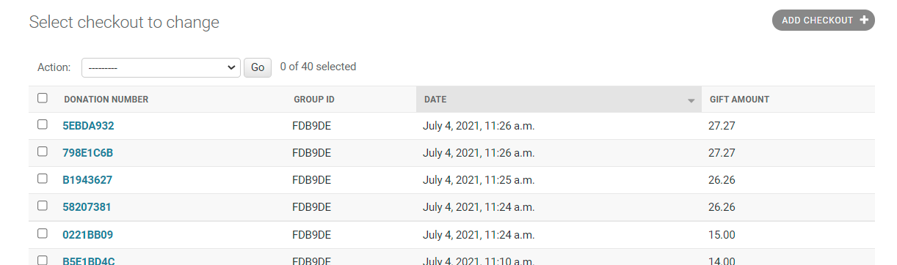
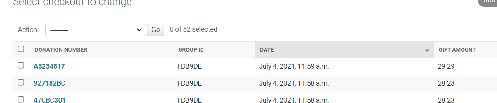

### Site Users Creation
As part of this project, I needed to create some Users automatically into django. Initially I started by trying to create a model and found I would need to Hash the password. I also wanted to create a UUID for each of the guest users. I tried multiple different ideas from [StackOverflow](https://stackoverflow.com/search?q=upload+users+to+django) and read lots of the [django](https://docs.djangoproject.com/en/3.2/topics/auth/) documentation. After many hours I talked to Code Institutes tutor support team and one of the main issues was I did not need to create a model for the users.json table because it already existed as standard. 
When I ran the `python3 manage.py loaddata users` command I still got an error but this was related to the encoder my git environment was using. It was using `UFT-8 with BOM` and needed to user `UFT-8`. 
Once the users were loaded, the next step was to change the passwords to be hashed and the username to be a 6-character UUID using `uuid.uuid4().hex[:6].upper()`.

Complete change of plan. I'm going to create the users from the upload of the guest list. That way it is all inside the app instead of trying to createheroku logs --tail them outside of it. This also puts the ownership of the data bak onto the person uploading it.

I originally had the upload process as part of a modal but nothing I did seemed to get it to load into admin/. I raised a call with tutor support and Jo @ CI gave me this link [upload-csv](https://ramramesh1374.medium.com/upload-csv-using-django-bulk-create-c75b28fc19f0) This helped with the format of the view but I still had issues with the urls. Eventually I realise I had 2 get processes which was why the post view was not being processed. 

### Stripe/Gitpod workspace issue
When I had completed the upfront load of the checkout details, taken from the Guests model the payments appear in the Checkout model and in Stripe in the Events log but in the Webhook attempts log they were showing with a [502 error](images/bugs/502_events_log.png). After replaying the Stripe videos and speaking to tutor support, who reviewed my code and could find no issues, we decided to download the db.sqlite3 file, check the requirements.txt file was up to date, make sure everything was pushed to git and then start a new workspace. In the workspace there was a spurious file called [h](images/bugs/h.txt). After checking with the tutor, I decided to delete it. I then re-created the webhook and got a new secret key. I ran a [webhook test](images/bugs/web_hook_test.png) which was suddenly successful. I then ran a test from the website and verified the results. [Checkout Success View](images/bugs/checkout_success_page.png), [Checkout Model](images/bugs/checkout_model.png), [Guest Model](images/bugs/stripe_guest_model.png), [stripe payment](images/bugs/stripe_webhook_success.png), [stripe payment detail](images/bugs/stripe_webhook_success_detail.png)
Although Stripe is now working, it is not clear exactly what the issue was. It appears to have been something to do with the workspace but perhaps it was to do with the suprious "h" file that appeared after the GitPod issue on 30 June 2021.

### Gift amount showing twice in checkout model
Once all the stripe issues were fixed I decided to run some more tests to clean up the code which showed I was creating the wedding gift donation twice in the checkout model.
[first checkout object without pid](images/bugs/checkout_no_pid.png), [second checkout object with pid](images/bugs/checkout_with_pid.png)
This has happened because the first time the object is created it is not creating a stripe pid in the object.
After adding stripe_pid to `checkout = Checkout(group_id=group_id, gift_amount=gift_amount, stripe_pid=stripe_pid)` there is only one checkout object , [detail of checkout object](images/bugs/checkout_one_object_with_pid.png)

### Flake 8 remaining issues
The below messages relate to django password validation.
./ciara_and_sams_big_day/settings.py:144:80: E501 line too long (91 > 79 characters)
./ciara_and_sams_big_day/settings.py:147:80: E501 line too long (81 > 79 characters)
./ciara_and_sams_big_day/settings.py:150:80: E501 line too long (82 > 79 characters)
./ciara_and_sams_big_day/settings.py:153:80: E501 line too long (83 > 79 characters)
[image](user_story_docs/flake8.png)