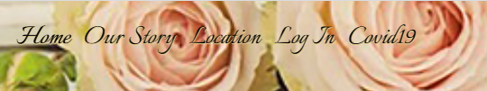
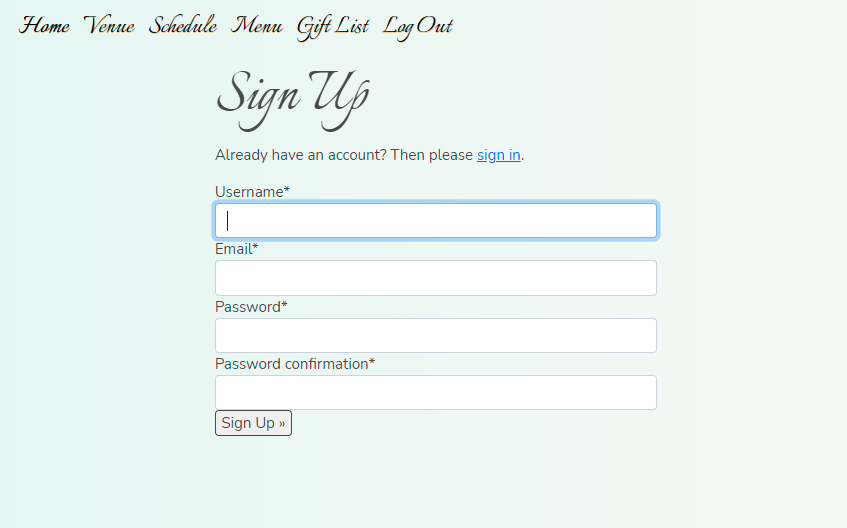
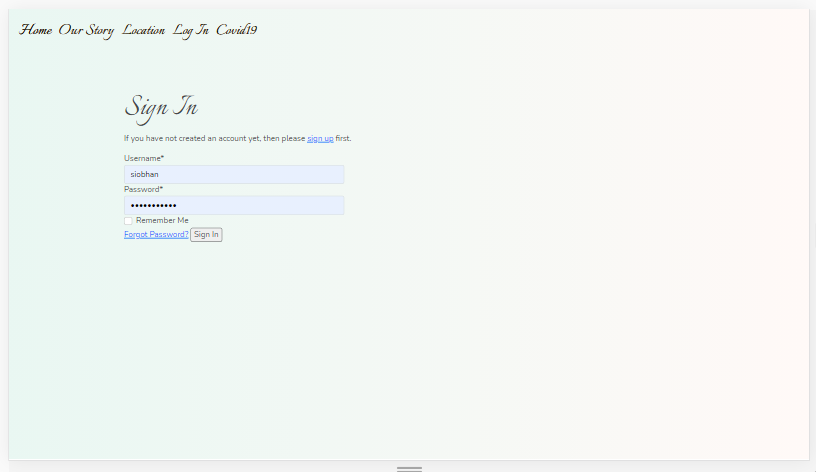
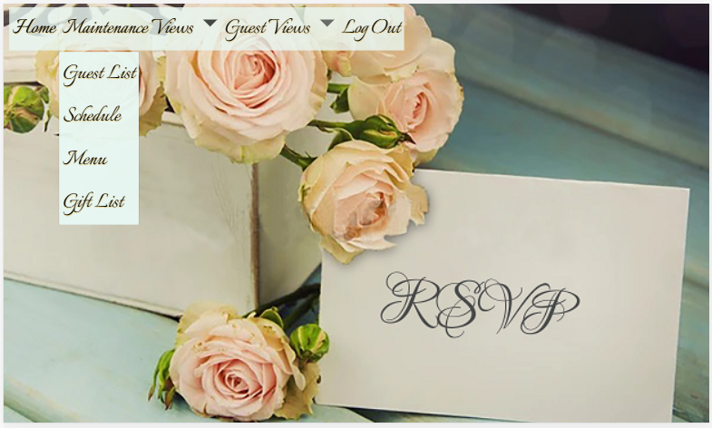
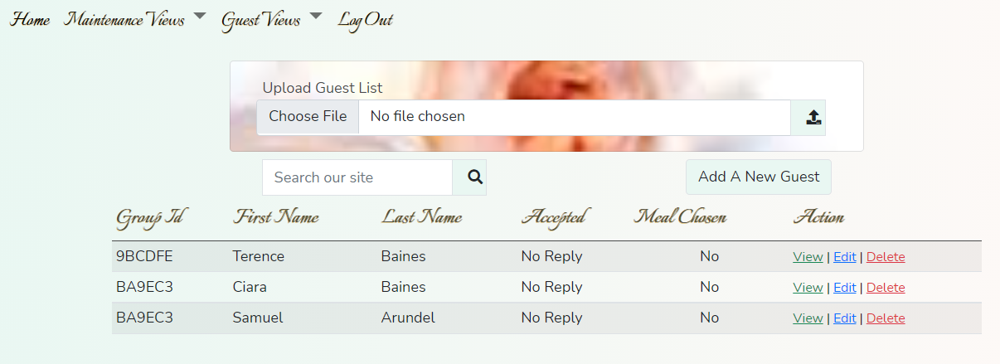
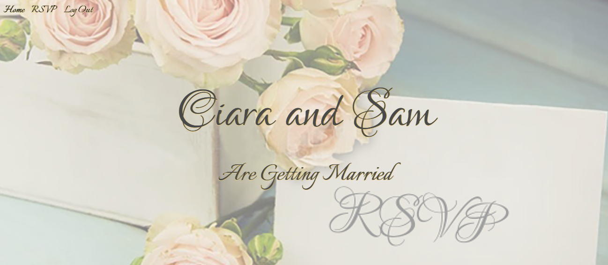

## Unit and Functional Testing
### Navigation
Due to the image on the landing page the navigation bar was not easily visible on many screen. . I modified the `background-color` on `nav-items`, `dropdown-menu` and `show` classes making the navbar stand out much more clearly.

## User Story Testing
#### Bride or Groom:  
1.  **As a user I want to register an account with administration access.**
When a user chooses to register on the site by clicking the 'bride and groom registration' link in the footer they are presented with the registration screen . Once registered the user will need to log in. Behind the scenes the user is created with `is_staff` authority. [admin view of bride or groom user settings](user_story_docs/siobhanbaines _ is_staff_user.pdf) 
2.  **As a user I want to be able to log into the website.**
When a user clicks the login navigation option they are presented with the login screen.  which takes them to the main menu for the bride and groom 
3.  **As a user I want to be able to create a list of all the wedding guests.**
Only a user who has either `staff` or `superuser` authority can add, update or delete a guest.
    *Upload File*
The Maintenance Views menu option has a drop-down menu giving acces to the [Guest List](user_story_docs/guest_list_maint.png) maintenance screen which has the ability to upload a [guest csv file](user_story_docs/guest-list.csv) into to guest model. 
    *Search*
The search facilty gives a wild card search on the first and last names of the guest. If the user enters the letter `r` in the search box, all guests with the letter r in their name will be displayed.. 
    *Add new guest details*
From the guest list maintenance screen the user can add a guest by clicking the `Add A New guest` button which will bring up the page to [add a new guest.](user_story_docs/add_guest.png)
    *Read/view guest details*
To view the individual guests a user can either click on the image or the `View` link which will take them to the [guest detail](user_story_docs/view_guest.png)page.
    *Update guest details*
A user needs to click the `Edit` link to [update/change a guest.](user_story_docs/edit_guest.png) The user will be informed they are editing a guest and which guest they are editing.
    *Delete guest* 
When a user [deletes](user_story_docs/delete_guest_message.png) a guest it will be removed from the model, the image will be removed from the media folder and they will be informed which guest they have deleted.
4.  **As a user I want to maintain a wedding guest list.**
Only a user who has either `staff` or `superuser` authority can add, update or delete a giftt.
    *Upload Gift File*
The gifts maintenance screen has the ability to upload a [gifts csv file](user_story_docs/gift-list.csv)into the gift model.
    *Add new giftt details*
From the gift list maintenance screen the user can add a gift by clicking the `Add A New Gift` button which will bring up the page to [add a new gift.](user_story_docs/add_gift.png)
    *Read/view gift details*
To view the individual gifts a user can either click on the image or the `View` link which will take them to the [gift detail](user_story_docs/view_gift.png)page.
    *Update gift details*
A user needs to click the `Edit` link to [update/change a gift.](user_story_docs/edit_gift.png) The user will be informed they are editing a gift and which gift they are editing.
    *Delete gift* 
When a user [deletes](user_story_docs/delete_gift_message.png) a gift it will be removed from the model, the image will be removed from the media folder and they will be informed which gift they have deleted.
5.  **As a user I want to use the list of guests who have accept to create the seating plan for the wedding breakfast.**
6.  **As a user I want to keep track of which guests have and have not RSVP'ed.**
The Guest List maintenance screen shows whether or not the guest has accepted, declined or not responded to the invitation.
7.  **As a user I want to keep track of which guests have or have not supplied their menu choices.**
The Guest List maintenance screen shows whether or not the guest has made their selection from the menu choices. To see what those choics are each guest can be viewed individually.
8.  **As a user I want to create a schedule for the day.**
9.  **As a user I want to provide the guests with details of the church.**
10. **As a user I want to provide the guests with details of the reception.**
11. **As a user I want to provide the guests with details of accommodation close to the reception.**
12. **As a user I want to provide the guests with details of local public transport.**
13. **As a user I want to know who as given a donation so I can thank them after the event.**
14. **As a user I want to have the ability to stop any Covid19 restrictions being displayed if the restrictions are lifted.**
#### Wedding Guest
15. **As a user I want to be able to log into the website.**
When a user clicks the login navigation option they are presented with the login screen.  which changes the menu adding the option to RSVP , which tkaes the user to the [rsvp menu](user_story_docs/rsvp_page.docx) so that they can accept or decline the invitation.
16. **As a user I want to provide my name and contact details.**
17. **As a user I want to accept the wedding invitation.**
18. **As a user I want to decline the wedding invitation.**
19. **As a user I want to provide details of all members of my party.**
20. **As a user I want to menu selections for all members of my party.**
21. **As a user I want to provide details of any specific dietry requirements.**
22. **As a user I want to choose a present from a list of gift ideas.**
23. **As a user I want to give a donation as a wedding present.**
24. **As a user I want confirmation of my invitation acceptance or decline.**
25. **As a user I want confirmation of my menu choices.**
26. **As a user I want confirmation of my donation.**
