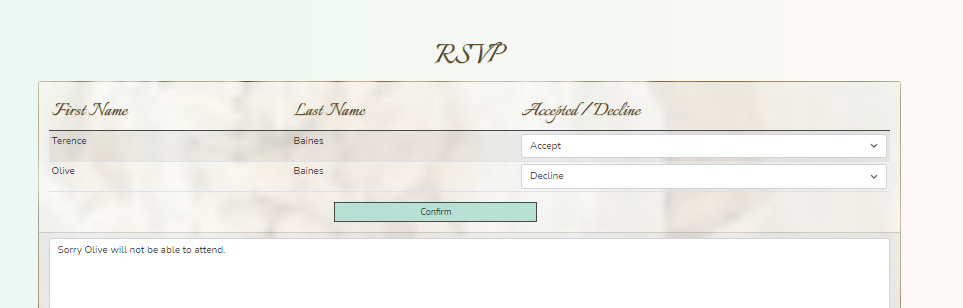
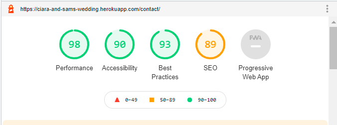
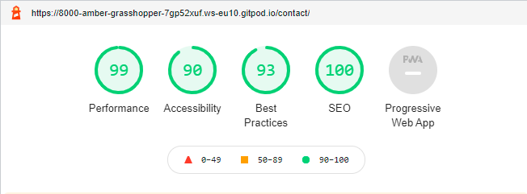
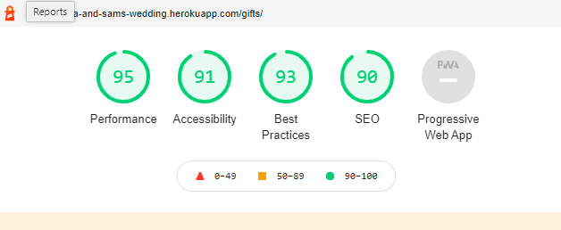

## Unit and Functional Testing
### Navigation
Due to the image on the landing page the navigation bar was not easily visible on many screens. . I modified the `background-color` on `nav-items`, `dropdown-menu` and `show` classes making the navbar stand out much more clearly.

## User Story Testing
#### Bride or Groom:  
1.  **As a user I want to register an account with administration access.**
When a user chooses to register on the site by clicking the 'bride and groom registration' link in the footer they are presented with the registration screen . Once registered the user will need to log in. Behind the scenes the user is created with `is_staff` authority. [admin view of bride or groom user settings](images/user-stories/non-image-documents/siobhanbaines-is-staff-user.pdf) 
2.  **As a user I want to be able to log into the website.**
When a user clicks the login navigation option they are presented with the login screen.  which takes them to the main menu for the bride and groom 
3.  **As a user I want to be able to create a list of all the wedding guests.**
Only a user who has either `staff` or `superuser` authority can add, update or delete a guest.
    *Upload File*
The Maintenance Views menu option has a drop-down menu giving acces to the [Guest List](images/user-stories/guest-list-maint.png) maintenance screen which has the ability to upload a [guest csv file](images/user-stories/non-image-documents/gift-list.csv) into to guest model. 
    *Search*
The search facilty gives a wild card search on the first and last names of the guest. If the user enters the letter `r` in the search box, all guests with the letter r in their name will be displayed.

    *Add new guest details*
From the guest list maintenance screen, the user can add a guest by clicking the `Add A New guest` button which will bring up the page to [add a new guest.](images/user-stories/add-guest.png)

    *Read/view guest details*
To view the individual guests a user can either click on the image or the `View` link which will take them to the [guest detail](images/user-stories/view-guest.png)page.

    *Update guest details*
A user needs to click the `Edit` link to [update/change a guest.](images/user-stories/edit-guest.png) The user will be informed they are editing a guest and which guest they are editing.

    *Delete guest* 
When a user [deletes](images/user-stories/delete-guest-message.png) a guest it will be removed from the model, the image will be removed from the media folder and they will be informed which guest they have deleted.
4.  **As a user I want to maintain a wedding guest list.**
Only a user who has either `staff` or `superuser` authority can add, update or delete a gift.

    *Upload Gift File*
The gifts maintenance screen has the ability to upload a [gifts csv file](images/user-stories/non-image-documents/gift-list.csv)into the gift model.

    *Add new gift details*
From the gift list maintenance screen, the user can add a gift by clicking the `Add A New Gift` button which will bring up the page to [add a new gift.](images/user-stories/add-gift.png)

    *Read/view gift details*
To view the individual gifts a user can either click on the image or the `View` link which will take them to the [gift detail](images/user-stories/view-gift.png)page.

    *Update gift details*
A user needs to click the `Edit` link to [update/change a gift.](images/user-stories/edit-gift.png) The user will be informed they are editing a gift and which gift they are editing.

    *Delete gift* 
When a user [deletes](images/user-stories/delete-gift-message.png) a gift it will be removed from the model, the image will be removed from the media folder and they will be informed which gift they have deleted.
5.  **As a user I want to use the list of guests who have accept to create the seating plan for the wedding breakfast.**
This user story has not been implemented at this time and will developed in a future release.
6.  **As a user I want to keep track of which guests have and have not RSVP'ed.**
The Guest List maintenance screen shows whether or not the guest has accepted, declined or not responded to the invitation. The user can also sort the guest list by whether or not the guest has accepted the invitation. 

7.  **As a user I want to keep track of which guests have or have not supplied their menu choices.**
The Guest List maintenance screen shows whether or not the guest has made their selection from the menu choices. The list can besorted by `Meal Chosen` to help the user see who still has to chose their meal. The full details of which menu option the guest has chosen is available on the guest view page.

8.  **As a user I want to create a schedule for the day.**
Only a user who has either `staff` or `superuser` authority can add, update or delete the schedule.

    *Upload Schedule File*
The schedule maintenance screen has the ability to upload a [schedule csv file](images/user-stories/non-image-documents/schedule.csv)into the schedule model.

    *Add new schedule details*
From the schedule list maintenance screen, the user can add a schedule item by clicking the `Add A New Event` button which will bring up the page to [add a new event](images/user-stories/schedule-add.png)

    *Read/view schedule details*
To view the schedule a user can use the `View` link which will take them to the [schedule detail](images/user-stories/schedule-view.png)page.

    *Update schedule details*
A user needs to click the `Edit` link to [update/change a schedule](images/user-stories/schedule-edit.png) The user will be informed they are editing a schedule and which schedule they are editing.

    *Delete schedule* 
When a user [deletes](images/user-stories/schedule-delete.png) a schedule it will be removed from the model and they will be informed a scheduled event has been deleted.
9.  **As a user I want to provide the guests with details of the church.**
Only a user who has either `staff` or `superuser` authority can add, update or delete a venue.

    *Add new venue*
Clicking the `Add A New Venue` button on the Venue maintenance page will bring up the page to [add a new venue](images/user-stories/venue-add.png) This includes an image, a website link and the latitude and longitude of the venue which can be found on google maps by entering the venues postcode.

    *Read/view venue details*
The venue details will be displayed on the Venue maintenance page. [venue detail](images/user-stories/venue-detail.png)page.

    *Update gift details*
To edit a venue there is an `Edit` link at the bottom of the page. [update/change a venue.](images/user-stories/venue-edit.png) The user will be informed which venue they are [editing](images/user-stories/venue-edit-message.png) 

    *Delete gift* 
When a user [deletes](images/user-stories/venue-delete.png) a gift it will be removed from the model, the image will be removed from the media folder and they will be informed which gift they have deleted.
10. **As a user I want to provide the guests with details of the reception.**
As with user story 9 for details of the chucrch, the reception is maintained in the venue maintenance.
11. **As a user I want to provide the guests with details of accommodation close to the reception.**
This user story has not been implemented at this time and will developed in a future release.
12. **As a user I want to provide the guests with details of local public transport.**
This user story has not been implemented at this time and will developed in a future release.
13. **As a user I want to know who as given a donation so I can thank them after the event.**
If a guest has sent some money as a wedding gift a user can see this on the guest details page.
14. **As a user I want to have the ability to stop any Covid19 restrictions being displayed if the restrictions are lifted.**
This user story has not been implemented at this time and will developed in a future release.
#### Wedding Guest
15. **As a user I want to be able to log into the website.**
When a user clicks the login navigation option they are presented with the login screen.  which changes the menu adding the option to RSVP , which tkaes the user to the [rsvp menu](images/user-stories/non-image-documents/rsvp-page.docx) so that they can accept or decline the invitation.

16. **As a user I want to provide my name and contact details.**
This user story has not been implemented at this time and will developed in a future release.
17. **As a user I want to accept the wedding invitation.**
When a user has successfully logged in they can accept the invitation and leave a message to the bride and groom if they wish to. Once they have accepted they will be taken back to the home page and a new menu will appear.
18. **As a user I want to decline the wedding invitation.**
When a user has successfully logged in they can decline the invitation and leave a message to the bride and groom if they wish to. Once they have accepted they will be taken back to the home page and a new menu will appear.. Even though a guest has declined the invitation they may still wish to buy a gift for the bride and groom. 
19. **As a user I want to provide details of all members of my party.**
The user can accept or decline the invitation for each member of the invitation group and leave a message when they RSVP. There is also the ability to leave a message for the bride and groom

The bride and groom can also see who out of an invitation group is attending and who is not on the guest maintenance view and on the individual guest details.
If something changes, the guests will still have the ability to change their response to the invitation.
20. **As a user I want provide menu selections for all members of my party.**
A user will be able to select the `Menu` navigation button which will open the [menu detail page](images/user-stories/menu-detail.png). At the bottom of the page is a menu selection button which will take the user the to menu selection page where they can choose which dishes they want for each course.

21. **As a user I want to provide details of any specific dietry requirements.**
As part of the menu selection page there is a section to enter details about any special dietary requirements which will be added to the guest details
22. **As a user I want to choose a present from a list of gift ideas.**
A user can either click on the image of the gift or on the `view` button at the bottom of the [gift card](images/user-stories/gift-card.png) to open up the details of the gift. . The gift page has a checkbox to allow the guest to select the gift they intend to purchase for the bride and groom which is only to help stop duplicate gifts being bought. There is also a link to a site that supplies the gift that the user can buy from. This also allows the user to buy from else where if they desire.
23. **As a user I want to give a donation as a wedding present.**
On the main gifts page there is a box to enter the amount a user wishes to donate and a button to take them to a [checkout page](images/user-stories/checkout.png) where the user can use a payment card of their choice to send the money. Once the payment has completed a [confirmation page](images/user-stories/payment-confirmation.png) appears.
24. **As a user I want confirmation of my invitation acceptance or decline.**
When a user RSVP's the invitation and if there is an email address they will receive either a confirmation email either for an [acceptance](images/user-stories/non-image-documents/wedding-acceptance.msg) or [declination](images/user-stories/non-image-documents/wedding-decline.msg)
25. **As a user I want confirmation of my menu choices.**
When a user submits their menu selection they receive an email if they have an email address on file.
[email](images/user-stories/non-image-documents/confirmation-of-meal-selection.msg)
26. **As a user I want confirmation of my donation.**
When a the payment of the gift donation is confirmed and the success page appears an email is sent to the user.
[email](/workspace/Ciara-and-Sams-Big-Day/images/user-stories/non-image-documents/confirmatiom-of-gift-payment-reciept.msg)

## Lighthouse Testing
### Contact Us
Before 
Adding meta description to Base.html `<meta name="description" content="Siobhan Baines | Software Developer | Leeds, UK">` will affect all Lighthouse readings.
After 

### Guest Gift List
Before 
Reduced image sizes by using [tinypng](https://tinypng.com/)
After 
